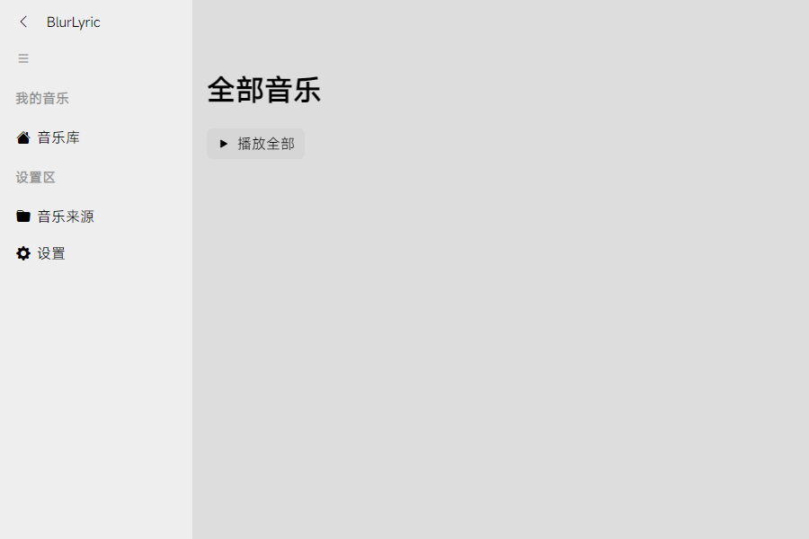
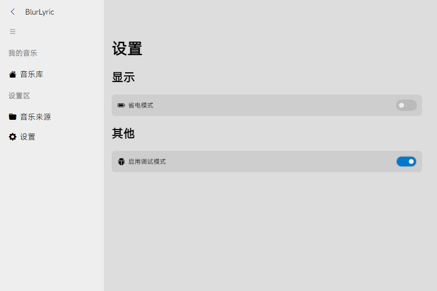
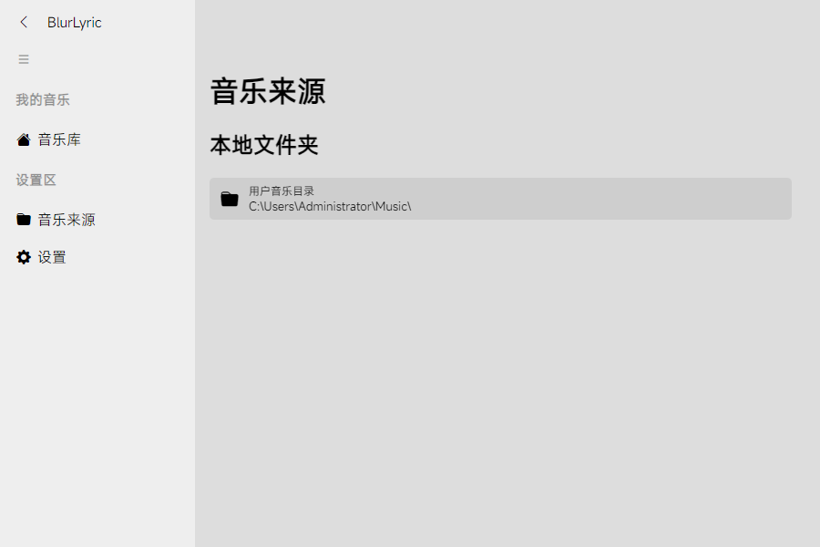

# BlurLyric 3.0

全新的使用tauri框架的美观多功能播放器！

## 特性 (持续更新中)
- 1.✅ 使用vue、tauri等框架带来的轻量级播放器。
- 2.❌ 支持本地音乐播放、网易云账号、webdev云盘关联等等。
- 3.❌ 支持本地音乐tag自动补全
- 4.✅ 丝滑流畅动效体验
- 5.❌ 多设备、尺寸适配
- 6.❌ 串流播放

### 特别感谢以下项目为我们提供灵感、参考设计和功能代码：
- [Binaryify/NeteaseCloudMusicApi](https://github.com/Binaryify/NeteaseCloudMusicApi)
- [tauri](https://tauri.app/)
- [vue](https://vue3js.cn/)
- [qier222/YesPlayMusic](https://github.com/qier222/YesPlayMusic)
- [LyricEase](https://apps.microsoft.com/store/detail/lyricease/9N1MKDF0F4GT?hl=zh-cn&gl=CN)
- [Apple Music](https://www.apple.com/apple-music/)
- [Spotify](https://www.spotify.com/)
- [JetBrains](https://www.jetbrains.com/)
- [Cloudflare](https://www.cloudflare.com/)

## 应用内截图一览 
浏览版本为3.0.0.240405

当前项目为个人练手项目，更新慢/bug多请见谅！还请多多提交push帮助项目完成